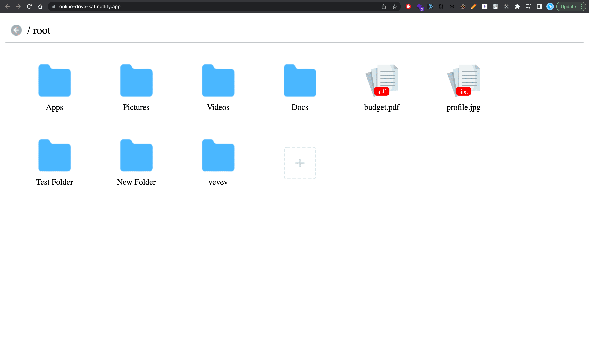

# Online Drive
This app simulates an online drive file structure using Json data. App is build using **React JS**
Try this app [https://online-drive-kat.netlify.app](https://online-drive-kat.netlify.app/)

### Get started
- open terminal 
- `git clone https://github.com/kartarkat/online-drive.git`
- `cd online-drive`
- `npm i`
- `npm start`

### Actions
- **Create** -> Folder / File
- **Rename** -> Folder / File
- **Delete** -> Folder / File
- **Check** -> Folder / File already present

### Validations 
- **Proper File Name** - > Eg: fileName.extension
- **Proper Folder Name** -> Eg: folderName
- **Duplicates** -> Not allowed in same level
- **Special Characters** -> Not allowed (<, >, :, ", /, \\, |, ?, *)

### Components
- **Files**  -> To render, the current file level
- **File Item** - >To render al items in the files
- **Form**  -> To get user input
- **Modal** -> To display data in modal
- **Context Menu** -> custom menu for file item operations

### Hooks
**useTreeTraversal ()**  - since we are using tree like structure, create a custom hook to do crud operations in the tree. it has the following functions.
- insertNode
- deleteNode
- updateNode

### Preview
